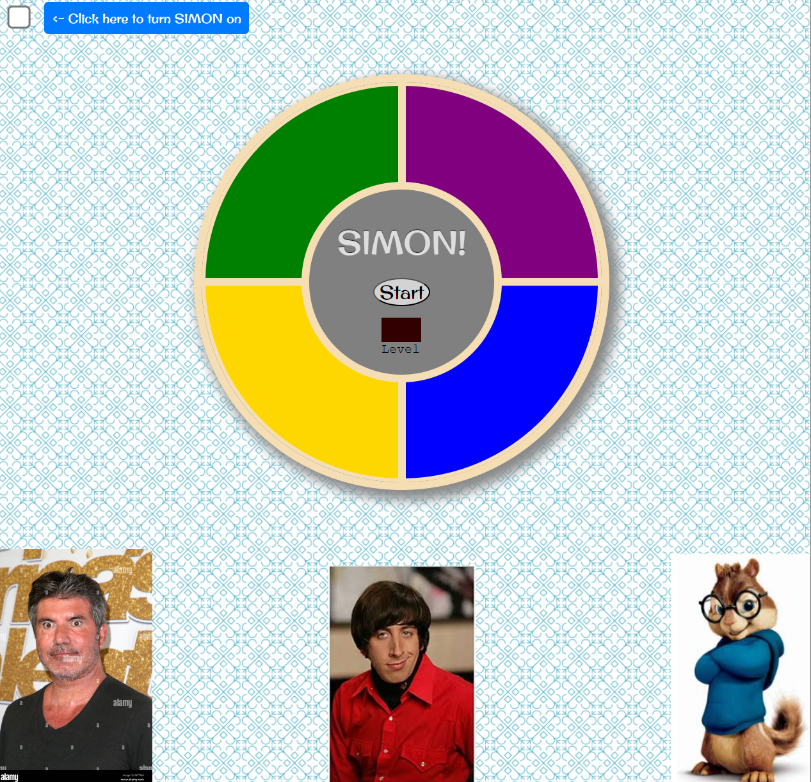

<Simon themed Simon game>

When playing this game, the computer will push the colored buttons in a certain pattern, and you, the user, will have to match the patterns displayed in order to move on to the next level, and eventually, win the game.

The first level starts with the computer hitting a single button, the second level adds a button after the existing one, and so on, until you beat level 5.

Technologies used: HTML, JavaScript & CSS.

Link to game: https://andrewzubal.github.io/Simon/

